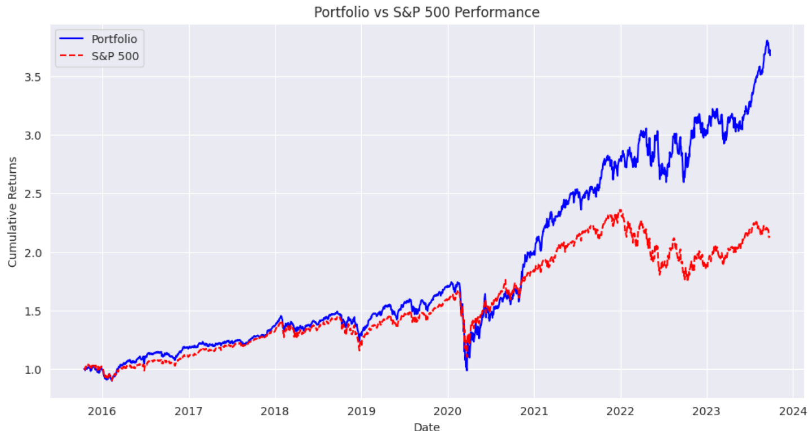

# Unsupervised Learning-Based Trading Strategy

This repository contains a Python script that implements an unsupervised learning-based trading strategy using technical analysis and financial factors. The strategy optimizes portfolio weights based on historical data and compares it with a benchmark (S&P 500).

## Table of Contents

- [Overview](#overview)
- [Technical Indicators Used](#technical-indicators-used)
- [Steps and Calculations](#steps-and-calculations)
- [Clustering and Strategy](#clustering-and-strategy)
- [Portfolio Optimization](#portfolio-optimization)
- [Comparison with Benchmark](#comparison-with-benchmark)
- [Dependencies](#dependencies)
- [Usage](#usage)

## Overview

This project applies machine learning techniques to financial data for constructing a trading strategy. It starts with downloading historical stock data for S&P 500 companies and technical indicators such as RSI, Bollinger Bands, MACD, ATR, and Garman-Klass volatility. K-Means clustering is used to identify groups of stocks, and the final portfolio is optimized using the maximum Sharpe ratio.

The final strategy is compared with a buy-and-hold strategy for the S&P 500 (represented by SPY).

## Technical Indicators Used

1. **Garman-Klass Volatility** - Measures volatility based on high, low, open, and adjusted close prices.
2. **RSI (Relative Strength Index)** - Indicates overbought or oversold conditions of stocks.
3. **Bollinger Bands** - Shows price volatility using upper, middle, and lower bands.
4. **ATR (Average True Range)** - Measures the volatility of stocks by averaging the true range over a period.
5. **MACD (Moving Average Convergence Divergence)** - A trend-following momentum indicator.
6. **Dollar Volume** - Represents the total value traded of a stock.

## Steps and Calculations

1. **Download Stock Data**: The stock data for the S&P 500 constituents is downloaded from Yahoo Finance for the last 8 years.
2. **Calculate Technical Indicators**: The indicators mentioned above are computed for each stock using the `pandas-ta` library.
3. **Top 150 Stocks by Dollar Volume**: Stocks are filtered based on dollar volume to focus on the most liquid stocks.
4. **Return Calculation**: Monthly returns for different time lags (1, 2, 3, 6, 9, 12 months) are calculated.
5. **Factor Data**: Fama-French 5-factor data is included to account for various market factors like size, value, profitability, and investment.

## Clustering and Strategy

### Unsupervised Learning

1. **K-Means Clustering**: Unsupervised learning is applied to the dataset to cluster stocks into 4 groups based on technical indicators and returns. This helps identify different behaviors in stock groups.
2. **Cluster Visualization**: The clusters are visualized using scatter plots where different clusters are represented by different colors.

## Portfolio Optimization

1. **Efficient Frontier**: The portfolio optimization is carried out using the `PyPortfolioOpt` library. The strategy aims to maximize the Sharpe ratio using mean-variance optimization.
2. **Rolling Window**: The optimization is done over a rolling window to ensure dynamic adjustment based on recent stock behavior.
3. **Equal Weights Fallback**: If the optimization fails, equal weights are assigned to the selected stocks.
   
## Comparison with Benchmark

The cumulative return of the optimized strategy is compared with the cumulative return of a buy-and-hold S&P 500 strategy (`SPY`). This comparison is plotted and displayed.

## Dependencies

- `yfinance`: For downloading historical stock data.
- `pandas-ta`: To compute technical indicators like RSI, MACD, Bollinger Bands, ATR.
- `PyPortfolioOpt`: For portfolio optimization.
- `statsmodels`: To fit rolling OLS models and calculate betas.
- `scikit-learn`: For clustering using K-Means.
- `pandas`: Data manipulation and resampling.
- `matplotlib`: Plotting results.

